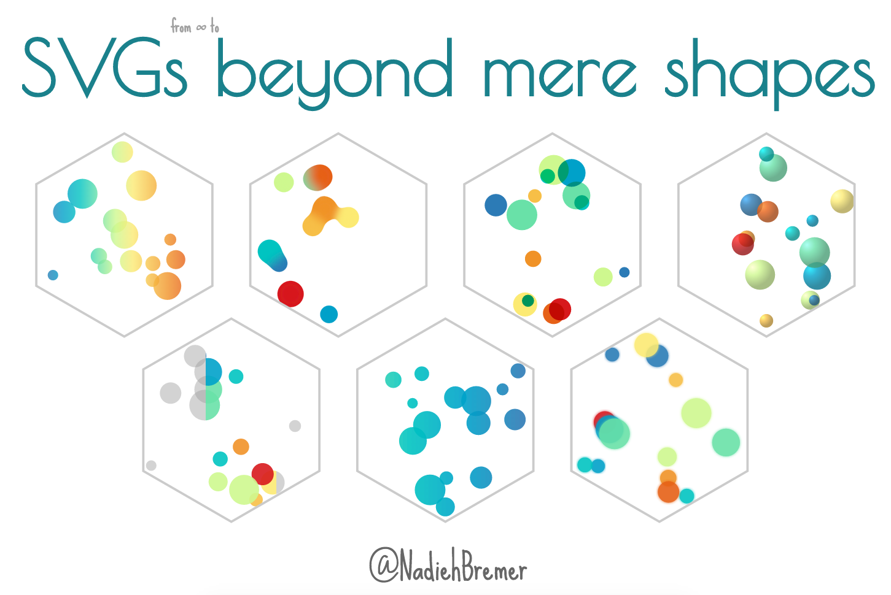

# SVGs beyond mere shapes

**The entire interactive presentation**

In this repo you can find the slides and underlying code for the presentation titled "SVGs beyond mere shapes". It might take a few seconds to load, but you should see something within ±10 seconds. Note that the presentation has a few CPU heavy slides, especially those with continuously moving objects

### Please, please look at these slides in Chrome

Tested with Chrome, Firefox and Safari. Definitely meant to be seen in Chrome. Even more so at a resolution of 1920x1080

[SVGs beyond mere shapes](http://nbremer.github.io/openvis2016/slides)

[Watch the video of the presentation itself](https://youtu.be/AwlA3SaChHE) that Bocoup made available

## Notes

If you're looking at the presentation at a different resolution than 1920x1080 the text has the tendency to twitch whenever you click on the next arrow and an animation occurs within the same slide. Not sure why this is...

The slides are meant to be viewed in a forward direction. I tried to make all slides work while you click back as well, but there might be some things that don't run quite right.

Some slides automatically run through a set of animations after a certain number of "next" key presses:

- The "planets-code" slide: After seeing an orange circle, press next one more time and the other 4 animations follow after a few seconds
- The "stretched-chord" slide: After the first next the other animations that change the chord diagram into a stretched chord diagram are automatic
- The "colorAdd-code" slide: After going next when you see the infinity loop of circles without a blend mode, the other color and blend mode options follow automatically, each several seconds after the other

There are also some animations that might take a second or so to start running after pressing the next arrow :)

If, for whatever strange reason, you don't want to use Chrome, here are some quirks with other browsers:

- Safari can't handle any spreadMethod besides the default "pad". Take a look at [these examples](https://bugzilla.mozilla.org/show_bug.cgi?id=379321) in Safari. Therefore, I made changes to the intro and stretched chord diagram ("batplot") to make it seem as if it is working in Safari too. But for the "Minard" slide this was too much of a hassle, so that one might look a bit odd in Safari
- It also seems that Safari can't handle the moving slider in the "title-slide" and the "intro-slider" slides (the one right before the Baby names slide), so I've deactivated the slider movement for Safari
- The colorAdd-blend-modes slide (with the 2 pairs of 3 overlapping circles with multiply and screen above them): you might see black circles for multiply. This was a bug and is fixed in the newest Firefox, so please update
- Never checked in IE, I'm guessing it would just be too horrible to look at...

Inside the slides/slides folder you'll see another layer of folders. Here each slide has gotten its own folder, but the numbering is based on the order in which I made them and not on the order on which they appear on the screen (this you can find in the index.html file).

I've used the code developed by [ptamarit](https://github.com/hakimel/reveal.js/issues/456) to use D3 (and D3 transitions) in RevealJS slides

### Bonus

Some extra interactivity that is possible that might not be apparent at first sight:

- In the "smooth-legend-SOM" slide with the Self-Organizing-Map (the hexagonal heatmap), move your mouse over the hexagons
- In the "orientation-final" slide, with the final result of the Avengers Chord Diagram, wait and see each Avenger highlighted in (random) turn
- In the "baby-names-final" slide, with the Baby names visual. This one is fully functional, so you can move the window at the bottom and hover over each line to see the name
- In the "slider-move-code" slide on the last section (after the grey-purple-grey rectangle is gone again), drag the coloured window. You can also increase and decrease the window by moving the ends of the coloured section
- In the "growth-bmi" slide, with all the lines going from grey to orange/red hover over the lines to see which country it is
- In the "spirograph" slide, click anywhere to get a different one drawn
- In the "collision-detection" slide, play with the circles and gooey with your mouse. However this only works properly if your window is at the 1920x1080 resolution